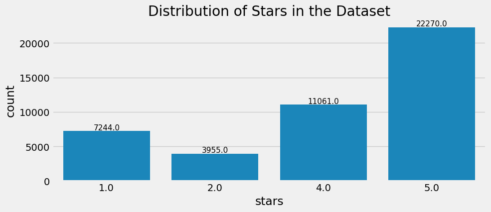

# Problem Statement
A worldwide hotel brand wants to comprehend the customer feedback they have collected. The feedback
comprises textual reviews from different sources, such as online websites, surveys, and social media.
They want to find out how happy or unhappy the customers are with the hotel services. We require you
to examine the feedback and evaluate the customer satisfaction level. Design and code a solution using
Python and machine learning. Please provide well-documented code, a model if any, and clear instructions
to run the code.

# SOLUTION
Our process will start with Exploratory Data Analysis, followed by Model Development employing both
Machine Learning and Deep Learning methodologies.
# EXPLORATORY DATA ANALYSIS
Now I have the customer feedback data, It’s time to perform Exploratory Data Analysis (EDA) to gain
insights and understand the data before further proceeding.
## Dataset
yelp_ratings.ċsv is customer feedback data having columns text,stars and sentiment.
## Observations
* The dataset contains a total of 44,530 records.
* No null values are present within the dataset.
* The dataset comprises three columns: ”text,” ”stars,” and ”sentiment.”
* The ”stars” column encompasses four categories: 1.0, 2.0, 4.0, and 5.0
* The ”sentiment” column consists of two categories: 0 and 1, where 0 signifies negative sentiment
and 1 represents positive sentiment.
* Stars rated 1.0 and 2.0 are classified as negative sentiment (0), while stars rated 4.0 and 5.0 are
categorized as positive sentiments.
## Distribution
### Distribution of stars
The following diagram shows the distribution of stars in the dataset.

